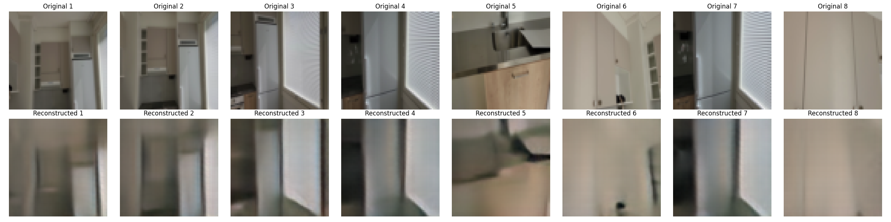

# Neural Video Compression using CompressAI

## 📖 Overview
This project implements neural video compression leveraging the CompressAI library. The goal is to explore advanced neural codecs for efficient compression of visual content, optimized using Rate-Distortion trade-offs.

## 📊 Results

| Metric | Average Value |
|--------|---------------|
| PSNR   | 28.76 dB      |
| SSIM   | 0.8146   |

[//]: # (Average PSNR: 28.76)

[//]: # (Average SSIM: 0.8146)

(Sample visualizations and reconstructions are available in the notebook and `output/` folder.)



## 🚀 Features
- CompressAI model integration (Ballé et al., 2018 factorized prior)
- Rate-distortion optimization with evaluation metrics
- Practical encoding and decoding scripts
- Clear evaluation and visualizations via notebook

## 📁 Project Structure

```
ML_Video_Portfolio_Project/
├── data/                  # Training dataset
├── test_data/             # Testing dataset
├── notebook/              # Jupyter notebook for evaluation
├── saved_models/          # Trained model weights
├── output/                # Outputs and reconstructions
├── data_loader.py         # Custom dataset loader
├── train.py               # Training script
├── pretrained_model.py    # CompressAI model definition & loading
└── README.md              # Project documentation (this file)
```

## ⚙️ Getting Started

### 1. Install dependencies
```bash
pip install -r requirements.txt
```

### 2. Dataset setup
Place training frames in `data/` and evaluation/test frames in `test_data/`.

### 3. Train the model
```bash
python train.py --data_dir data --epochs 30 --batch_size 4 --learning_rate 1e-4 --img_size 64
```

### 🔍 Evaluation
Run the provided notebook in `notebook/` for visual and quantitative evaluation.

### 📦 Encoding and Decoding
```bash
python encode.py
python decode.py
```


## 📖 References
- [CompressAI GitHub](https://github.com/InterDigitalInc/CompressAI)
- Ballé et al., 2018: *Variational image compression with a scale hyperprior*

## 🛡 License

This project is licensed under the [CC BY-NC-ND 4.0 License](https://creativecommons.org/licenses/by-nc-nd/4.0/).  
You may use this code for personal or academic purposes, but not for commercial use or redistribution.

